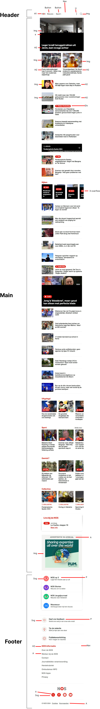
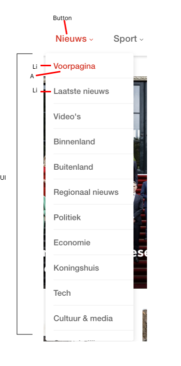

# Procesverslag
Markdown is een simpele manier om HTML te schrijven.  
Markdown cheat cheet: [Hulp bij het schrijven van Markdown](https://github.com/adam-p/markdown-here/wiki/Markdown-Cheatsheet).

Nb. De standaardstructuur en de spartaanse opmaak van de README.md zijn helemaal prima. Het gaat om de inhoud van je procesverslag. Besteedt de tijd voor pracht en praal aan je website.

Nb. Door *open* toe te voegen aan een *details* element kun je deze standaard open zetten. Fijn om dat steeds voor de relevante stuk(ken) te doen.

## Jij

  
uitwerken voor kick-off werkgroep

  ### Auteur:
  Joep van der List

  #### Je startniveau:
  Rood

  #### Je focus:
  responsive
 

## Je website

  
uitwerken voor kick-off werkgroep

  ### Je opdracht:
  (https://nos.nl)

  #### Screenshot(s) van de eerste pagina (small screen): 
  Homepagina 
  
  

  #### Screenshot(s) van de tweede pagina (small screen):
  Programma's pagina 
  
  
 

## Toegankelijkheidstest 1/2 (week 1)

  
uitwerken na test in 2e werkgroep

  ### Bevindingen
  Lijst met je bevindingen die in de test naar voren kwamen:
  * Er zaten best wat errors in de code
  * Het H1 element was niet aanwezig (voor zover ik kon vinden)
  * De alt zijn niet duidelijk over wat er op de foto te zien is
  * Alle titels zijn H2

  
  

## Breakdownschets (week 1)

  
uitwerken na afloop 3e werkgroep

  ### de hele pagina: 
  

  ### dynamisch deel (bijv menu): 
  

  ### wellicht nog een dynamisch deel (bijv filter): 
  

## Voortgang 1 (week 2)

  
uitwerken voor 1e voortgang

  ### Stand van zaken
  hier dit ging goed & dit was lastig (neem ook screenshots op van delen van je website en code)

  ### Agenda voor meeting
  samen met je groepje opstellen

  | Randi          | Lois               | Nienke       | Joep        |
  | ---            | ---                | ---          | ---              |
  | html checken  | html checken       | hulp met     | Extra uitleg over grid    |
  |                | fonts en achtergrond | hamburgermenu | font toevoegen uit downloads |
  | ...            | video's downloaden   | ...          | ...              |

  ### Verslag van meeting
  hier na afloop snel de uitkomsten van de meeting vastleggen

  Ik heb geleerd:
  - Hoe ik tekst op een foto krijg
  - Hoe ik een uitkapbare tekst /menu maak
  - Hoe ik iets ontzichtbaar voor de screenreader maak
  - 

## Voortgang 2 (week 3)

  
uitwerken voor 2e voortgang

  ### Stand van zaken
  hier dit ging goed & dit was lastig (neem ook screenshots op van delen van je website en code)

  ### Agenda voor meeting
  samen met je groepje opstellen

  | Randi          | Lois               | Nienke       | Joep             |
  | ---            | ---                | ---          | ---              |
  | Hulp met fonts | Hulp met fonts   | geen specifieke| gradient op foto |
  |                |                  | vraag          |                  |
  | ...            | ...                | ...          | ...              |

  ### Verslag van meeting
  hier na afloop snel de uitkomsten van de meeting vastleggen

  - groter maken van alleen 1e foto
  - schaduw op text fixen
  - lettertypen goed maken
  - begin gemaakt aan footer

## Toegankelijkheidstest 2/2 (week 4)

  
uitwerken na test in 9e werkgroep

  ### Bevindingen
  Lijst met je bevindingen die in de test naar voren kwamen (geef ook aan wat er verbeterd is):
  * Bij de meeste vragen/eisen had ik als "ja" als antwoord
  * De Focus state en Skip link had ik nog niet
  * De "high contrast" mode had ik niet, maar hoefde ik van de docent ook niet toe te voegen

  

## Voortgang 3 (week 4)

  
uitwerken voor 3e voortgang

  ### Stand van zaken
  hier dit ging goed & dit was lastig (neem ook screenshots op van delen van je website en code)

  ### Agenda voor meeting
  samen met je groepje opstellen

  || Randi          | Lois               | Nienke       | Joep        |
  | ---            | ---                 | ---          | ---              |
  | Het toevoegen  | Animatie op svg     | Audio bestand| Grid/responsiveness maken   |
  | van items in de| een voor toevoegen  | invoegen op  | rode p tag gefixed |
  | Nav op groot scherm|                 |  site        |               |

  ### Verslag van meeting
  hier na afloop snel de uitkomsten van de meeting vastleggen

  - (deels) Geleerd hoe je een responsive website maakt 
  - Geleerd hoe je items pas op bepaalde schermgrotes tevoorschijn laat komen
  - (deels) animaties (opnieuw, was het vergeten) leren toevoegen

## Eindgesprek (week 5)

  
uitwerken voor eindgesprek

  ### Je uitkomst - karakteristiek screenshots:
  

  ### Dit ging goed/Heb ik geleerd: 
  Korte omschrijving met plaatjes

  

  ### Dit was lastig/Is niet gelukt:
  Korte omschrijving met plaatjes

  

## Bronnenlijst

  
continu bijhouden terwijl je werkt

  Nb. Wees specifiek ('css-tricks' als bron is bijv. niet specifiek genoeg). 
  Nb. ChatGpT en andere AI horen er ook bij.
  Nb. Vermeld de bronnen ook in je code.

  1. Nos.nl 
  2. Docent
  3. Bahaa (+andere student assistent)
  4. https://css-tricks.com/snippets/css/a-guide-to-flexbox/ (Geen code overgenomen, maar wel naar gekeken hoe flexbox alweer werkte)
  5. https://www.w3schools.com/accessibility/accessibility_skip_links.php (Voor het maken van een Skip Link)
  6. Nienke (JS code)

